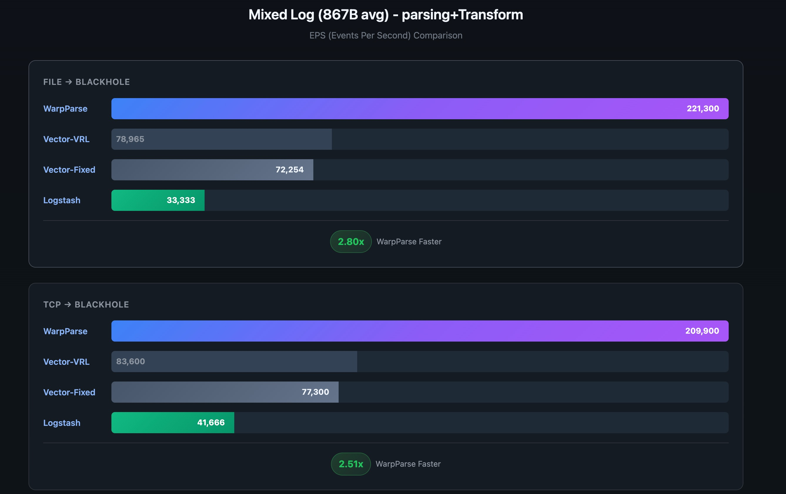
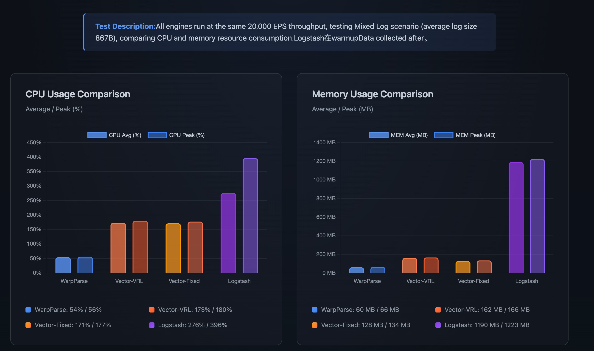

# WarpParse 对外开源发布

## 2026.1.23 在中国长沙的办公室，我们正式开源发布了新型研发的ETL引擎 - WarpParse

WarpParse 是一款面向可观测性、安全、实时风控和数据平台团队的高性能开源ETL引擎。经过充分的基准测试验证，WarpParse 在吞吐量、资源消耗和易用性等多个维度都达到业界领先水平。

## 新型ETL引擎有什么优势？

### 超越Vector吞吐量

WarpParse 在性能上实现了重大突破：

- **解析性能**：在混合日志场景下相比Vector-VRL提升 **3.4x-3.5x**
- **解析+转换性能**：提升 **2.8x-2.80x**
- **极限吞吐**：Nginx日志场景达到 **810,100 EPS**（File→BlackHole）
- **数据吞吐**：APT大包场景达到 **380+ MiB/s**

这些性能数据基于AWS EC2标准配置（8 vCPU / 16 GiB RAM）在完全公平的测试环境中获得，具有高度的可复现性和参考价值。

### 负载下资源最低

在相同的20,000 EPS固定吞吐量下，WarpParse展现出极优的资源利用效率：

- **CPU占用**：仅需 **54%** 平均CPU，相比Vector-VRL降低 **68.8%**，相比Logstash降低 **80.4%**
- **内存占用**：仅需 **60 MB** 平均内存，相比Vector-VRL降低 **63.0%**，相比Logstash降低 **95.0%**

这意味着在资源受限的边缘环境中，WarpParse能够用更少的资源完成相同的工作量，非常适合大规模部署和成本优化场景。

### 使用成本更低的DSL

WarpParse提供了两种革命性的领域特定语言（DSL）：

**WPL（WarpParse Language）** - 解析DSL
- 规则体积更小：相比正则表达式平均减少 **30-50%** 的配置复杂度
- 内置逻辑感知算子：支持 `alt`（择一容错）、`opt`（可选匹配）、`some_of`（循环探测）等高级特性
- 集成化流水线：在单一表达式中完成清洗和解析，避免多个组件间的数据传递开销

**OML（Object Modeling Language）** - 转换DSL
- 声明式建模：用户只需描述"要什么"而不用关心"怎么做"
- 原生SQL集成：支持在构建对象时直接查询数据库进行实时数据增强
- 灵活的聚合构造：支持复杂的嵌套JSON对象构建和数组聚合

这两种DSL相比传统的正则表达式和Lua脚本，大幅降低了规则编写的难度和维护成本。

## 对于我们的客户、行业有什么价值？

### 可观测性和安全分析

- **高性能日志处理**：支持海量日志实时摄取和分析，满足安全威胁检测的低延迟需求
- **灵活的数据转换**：通过WPL和OML快速适配各类日志格式，包括Nginx、Sysmon、APT威胁日志等
- **实时数据富化**：利用OML的SQL集成能力，将原始日志与用户信息、地理位置等上下文关联

### 成本优化

- **资源节省**：相同的日志处理能力，WarpParse所需的硬件投入显著更低
- **运维简化**：单二进制部署，配置化管理，无需复杂的多组件编排
- **规模效应**：在大规模部署中，CPU和内存的节省可带来可观的TCO降低

### 生态兼容

- **统一连接器API**：支持Kafka、MySQL、Elasticsearch、VictoriaLog、Doris等主流数据源和目标
- **开源协议**：采用Apache 2.0开源协议，提供商业级支持和保证
- **社区驱动**：欢迎开发者贡献新的连接器和优化方案

### OpenSource 采用Apache 2.0协议

WarpParse 采用了Apache License 2.0开源协议：

- **自由使用**：所有用户可以自由下载、使用和修改源代码
- **商业友好**：开放的许可证，允许商业应用和衍生产品
- **社区贡献**：欢迎社区提交PR和贡献，完善生态
- **长期支持**：大禹安全承诺为WarpParse提供持续的技术支持和功能迭代

## WarpParse 的未来如何发展？

### 2026规划

- **生态扩展**：新增更多连接器支持，覆盖主流数据平台
- **工具链完善**：发布wpgen代码生成工具、wprescue故障诊断工具、wproj项目管理工具等运维工具套件
- **WPL/OML完善**：根据社区反馈扩展语义类型和协议、扩展管道函数库。
- **WP-Editor完善**：增强在线编辑器功能，改进错误定位和使用体验
- **WP-Rule运营**：建立社区规则库，共享常见日规则。
- **全球生态**：建立国际开发者社区，推动WarpParse的使用

## 我们的承诺

WarpParse不仅是一个高性能的技术产品，更是我们对开源社区的深入承诺。我们相信：

- **性能是基础**：高效的资源利用是所有应用的前提
- **易用性是关键**：好的DSL设计能显著提升开发效率
- **开放是方向**：开源和社区驱动能加速创新迭代

我们欢迎所有对高性能ETL引擎感兴趣的开发者、架构师和运维人员加入WarpParse社区，共同推动数据处理技术的进步。

    Seeker-zuo  2026-1-24
---

**立即开始：**
- **GitHub**: https://github.com/wp-labs/warp-parse
- **Documentation**: https://wp-labs.github.io/wp-docs
- **Online Editor**: https://editor.warpparse.ai
- **Download**: https://github.com/wp-labs/warp-parse/releases
